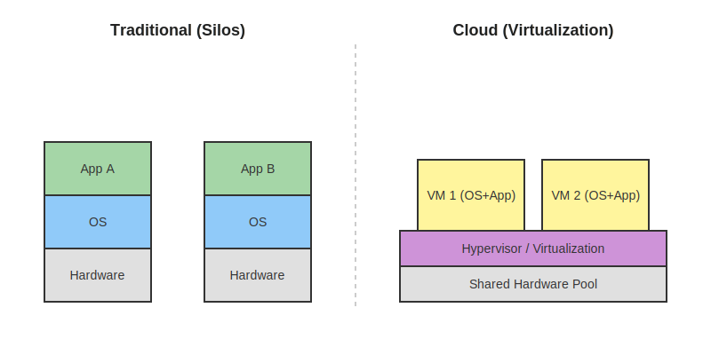
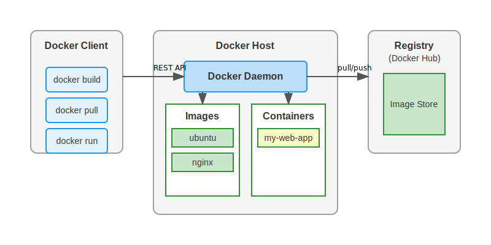
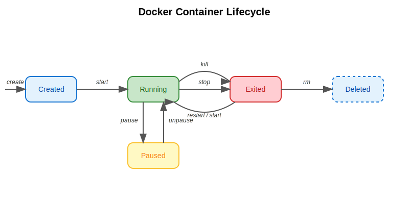
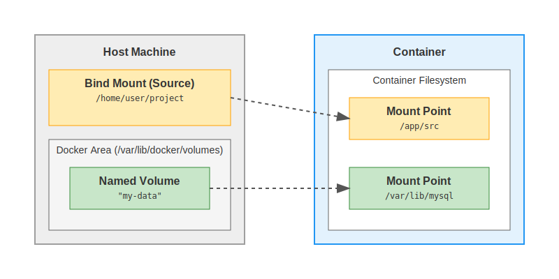
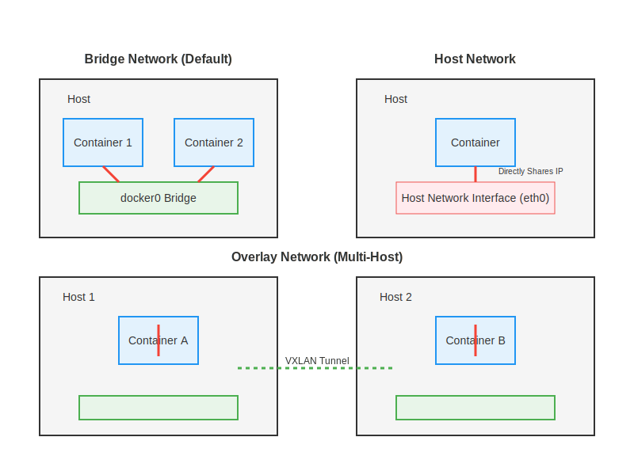
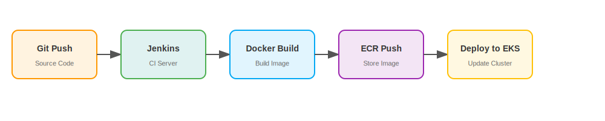

# EKS Training: From Ground to Cloud

## 5-Day Intensive Workshop

---

# Welcome & Objectives

## 🎯 Course Goals

- **Understand** core Container & Kubernetes concepts
- **Build** Docker images and run containers
- **Deploy** production-ready EKS clusters
- **Master** Kubernetes primitives (Pods, Deployments, Services)
- **Automate** with Infrastructure as Code & CI/CD
- **Scale** & **Secure** applications for production

## 📅 The Week at a Glance

- **Day 1:** Cloud & Docker Fundamentals
- **Day 2:** Docker Deep Dive & Networking
- **Day 3:** Kubernetes Architecture & Manual Setup
- **Day 4:** Workloads, Storage & Automation
- **Day 5:** Advanced Networking, Scaling & CI/CD

> **🗣️ Speaker Notes:**
>
> - Welcome the 6 participants.
> - Emphasize this is a "Zero to Hero" journey.
> - We start with basics (why cloud?) and end with advanced CI/CD pipelines.
> - Highlight that this is 70% hands-on.
> - Ask about their current experience level (Traditional hosting? AWS experience?).

---

# Day 1: Cloud & Docker Basics

## From Iron to Containers

## 🏢 Traditional vs. Cloud

- **Traditional:** Physical servers, static capacity, CAPEX model.
- **Cloud:** Virtual resources, elastic scaling, OPEX model.
- **Virtualization:** Hypervisors (VMware, Hyper-V) vs. Containerization.

## 📦 What is a Container?

- **Lightweight:** Shares OS kernel, isolated user space.
- **Portable:** "Build once, run anywhere" (Laptop -> Test -> Prod).
- **Fast:** Seconds to start vs. minutes for VMs.

## 🏗️ Docker Architecture

- **Daemon:** Background service managing objects.
- **Client:** CLI tool (`docker build`, `docker run`).
- **Registry:** Store for images (Docker Hub, ECR).

> **🗣️ Speaker Notes:**
>
> - Use the analogy of shipping containers: standardized units that fit on any ship/truck.
> - Contrast VMs (full OS overhead) vs Containers (just the app + libs).
> - **Activity Reference:** `Activity1-Prerequisites/01-Traditional-vs-Cloud-Comparison.md` & `02-Docker-Basics.md`.

---

# Day 1: Hands-On Lab

## Getting Your Hands Dirty

## 🛠️ Key Commands

1. **Pull:** `docker pull nginx:latest`
2. **Run:** `docker run -d -p 80:80 nginx`
3. **Exec:** `docker exec -it <container_id> bash`
4. **Commit:** Save changes as a new image.
5. **Push:** Upload to registry.

## 🧪 Lab Objectives

- Install Docker (Activity 2).
- Pull an image from Docker Hub.
- Run a web server container.
- Access it from your browser.
- Modify the container and save your changes.

> **🗣️ Speaker Notes:**
>
> - Guide them through `Activity2-Tools-And-Commands` for setup.
> - Focus on understanding the lifecycle: Image -> Container -> Running Process.
> - Discuss port mapping (`-p 80:80`) - critical concept for networking later.

---

# Day 2: Docker Internals

## Under the Hood

## 🧩 Core Technologies

- **Namespaces:** Process isolation (PID, NET, MNT). "What can I see?"
- **Cgroups:** Resource limitation (CPU, Memory). "What can I use?"
- **Union Filesystem:** Layered images.

## 🍰 Image Layers & COW

- **Layers:** Read-only, stacked on top of each other.
- **Copy-On-Write (COW):** Only modified files are copied to the writable top layer.
- **Efficiency:** Shared base layers save disk space and bandwidth.

## 🔄 Docker Lifecycle

- `create` -> `start` -> `pause` -> `stop` -> `kill` -> `rm`.

> **🗣️ Speaker Notes:**
>
> - Explain why layers matter (caching builds).
> - Discuss "Ephemeral" nature of containers - don't store data inside the container layer!
> - **Activity Reference:** `modules.yml` Day 2 topics.

---

# Day 2: Building Images

## Infrastructure as Code for Apps

## 📄 The Dockerfile

- **FROM:** Base image (e.g., `node:18-alpine`).
- **WORKDIR:** Set working directory.
- **COPY:** Add files.
- **RUN:** Execute build commands (install deps).
- **CMD vs ENTRYPOINT:** Default command vs. executable.

## 🧪 Lab: Build Your Own

1. Create a simple HTML/Node.js app.
2. Write a `Dockerfile`.
3. `docker build -t my-app:v1 .`.
4. Run and verify.

> **🗣️ Speaker Notes:**
>
> - Explain `RUN` happens at build time, `CMD` at runtime.
> - Best practices: minimize layer count, use `.dockerignore`.
> - **Activity Reference:** `sample-app/frontend/Dockerfile`.

---

# Day 2: Storage & Networking

## Connecting the Dots

## 💾 Docker Volumes

- **Bind Mounts:** Link host folder to container (good for dev).
- **Volumes:** Managed by Docker, independent of host FS structure (production).
- **Why?** Persistence. Containers are ephemeral; volumes survive restarts.

## 🌐 Docker Networking

- **Bridge:** Default. Containers talk on internal IP subnet.
- **Host:** Container shares host's network stack (fast but risky).
- **None:** No networking.
- **Overlay:** Multi-host networking (Swarm/K8s foundation).

> **🗣️ Speaker Notes:**
>
> - Lab: Connect a Web container to a MySQL container using a custom bridge network.
> - Emphasize: "Cattle, not pets." If a container dies, data in a Volume is safe.

---

# Day 3: Kubernetes Architecture

## Orchestrating the Chaos

## 🎻 Why Orchestration?

- Managing 1 container is easy. Managing 100 is hard.
- **Needs:** Auto-restart, scaling, load balancing, service discovery.

## 🏗️ The Cluster

- **Control Plane (Master):** Brain of the operation.
  - API Server, Etcd (store), Scheduler, Controller Manager.
- **Worker Nodes:** Where apps run.
  - Kubelet (agent), Kube-proxy (network rules), Container Runtime (Docker/containerd).

> **🗣️ Speaker Notes:**
>
> - **Analogy:** Conductor (Master) vs. Musicians (Nodes).
> - Explain that in EKS, AWS manages the Control Plane for us (Activity 3).
> - **Activity Reference:** `Activity1-Prerequisites/03-Kubernetes-Concepts.md`.

---

# Day 3: The "Hard" Way (Console)

## Manual EKS Creation

## 🛠️ Components We Build

1. **VPC:** Network foundation (Subnets, Route Tables, IGW).
2. **IAM Roles:** Permissions for Cluster and Nodes.
3. **EKS Control Plane:** The managed service.
4. **Node Group:** EC2 instances (Workers) - using Spot instances for cost!

## 💡 Why Manual?

- To understand the "Magic."
- Troubleshooting requires knowing what lies beneath.

> **🗣️ Speaker Notes:**
>
> - This is **Activity 3**. It takes time (3-4 hours).
> - Highlight cost management: "We use Spot instances to save 70%."
> - Warn about cleanup! EKS costs money if left running.

---

# Day 4: Kubernetes Primitives

## The Building Blocks

## 🧱 Core Objects

- **Pod:** Smallest unit. One or more containers (sidecars). Shared IP/Storage.
- **ReplicaSet:** Ensures N copies are running.
- **Deployment:** Manages ReplicaSets. Rolling updates & rollbacks.
- **Service:** Stable networking endpoint (ClusterIP, NodePort, LoadBalancer).
- **Namespace:** Virtual cluster separation.

## 🏷️ Labels & Selectors

- How K8s groups things.
- Service selects Pods via Labels (`app: my-app`).

> **🗣️ Speaker Notes:**
>
> - Draw the hierarchy: Deployment -> ReplicaSet -> Pod.
> - Explain how a Service "finds" Pods dynamically, even as they die and respawn.
> - **Activity Reference:** `Activity4-Scripted-Setup/00-Kubernetes-Primitives-Overview.md`.

---

# Day 4: Automation (IaC)

## The Production Way

## 🤖 eksctl & IaC

- **Infrastructure as Code:** Define cluster in YAML (`cluster-config.yaml`).
- **eksctl:** One command to rule them all. Replaces 50 manual steps.
- **Reproducible:** Git-versioned infrastructure.

## 🏭 Microservices vs Monolith

- **Monolith (Day 3):** Single deploy unit. Hard to scale parts.
- **Microservices (Day 4):** Decoupled Frontend/Backend. Scale independently.

> **🗣️ Speaker Notes:**
>
> - **Activity 4**. Compare the speed: 20 mins (automated) vs 3 hours (manual).
> - Lab: Deploy the Todo App as separate Frontend and Backend services.

---

# Day 4: Workloads & Storage

## Beyond Stateless Apps

## 💾 StatefulSets

- **Use Case:** Databases (MySQL), queues.
- **Features:** Stable network identity (`db-0`, `db-1`), ordered deployment.
- **Storage:** PersistentVolumeClaim (PVC) templates.

## ⚡ Jobs & CronJobs

- **Jobs:** Run to completion (Batch processing).
- **CronJobs:** Scheduled tasks (Backups).

## 🗄️ Persistent Volumes (PV/PVC)

- Decouples storage from Pod lifecycle.
- **StorageClass:** "I want fast SSD" (gp3).
- **PVC:** "I need 10GB."

> **🗣️ Speaker Notes:**
>
> - **Activity 5 Part A**.
> - Work through the MySQL StatefulSet example.
> - Discuss `Secrets` and `ConfigMaps` for configuration management.

---

# Day 5: Networking & Scaling

## Handling Traffic & Load

## 🚦 Ingress & ALB

- **Service (L4):** Simple TCP load balancing.
- **Ingress (L7):** HTTP/HTTPS routing (Host/Path based).
- **ALB Controller:** Translates Ingress to AWS Application Load Balancer.

## 📈 Auto-scaling

1. **HPA (Horizontal Pod Autoscaler):** Adds _Pods_ based on CPU/Memory.
2. **CA (Cluster Autoscaler):** Adds _Nodes_ when Pods can't fit.

> **🗣️ Speaker Notes:**
>
> - **Activity 5 Part B**.
> - This is where it gets "Production Ready."
> - Lab: Load test the app and watch it auto-scale!

---

# Day 5: CI/CD Pipeline

## Automating Delivery

## 🚀 The Pipeline

## 🛠️ Components

- **Jenkins on K8s:** Dynamic build agents (Pods).
- **ECR:** AWS private container registry.
- **GitOps:** Managing deployments via Git commits.

## 🔄 Deployment Strategies

- **Rolling Update:** Zero downtime standard.
- **Blue/Green:** Switch traffic instantly.
- **Canary:** Test with % of users.

> **🗣️ Speaker Notes:**
>
> - **Activity 5 Part C**.
> - Walk through the `Jenkinsfile`.
> - Demonstrate a code change automatically deploying to the cluster.

---

# Wrap Up & Next Steps

## The Journey Continues

## 🎓 Recap

- Basics -> Manual EKS -> Automated EKS -> Advanced Patterns.
- You have built a production-grade platform!

## 📚 Resources

- **EKS-Training Folder:** All guides and manifests.
- **Modules.yml:** Your curriculum map.
- **AWS Documentation:** EKS User Guide.

## ❓ Q&A

- Any final questions?
- **Reminder:** PLEASE DELETE YOUR CLUSTERS! (`eksctl delete cluster ...`)

> **🗣️ Speaker Notes:**
>
> - Thank the participants.
> - Reiterate cost warning one last time.
> - Encourage them to use the `cheatsheets` provided in Activity 2.
